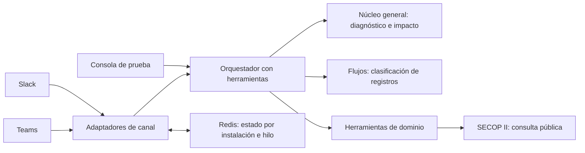

# Agentic Process Optimizer

Agente para descubrir trabajo repetitivo con evidencia, preguntar por datos faltantes, diagnosticar, recomendar y ejecutar intervenciones acotadas. El núcleo es independiente del sector. SECOP es una herramienta opcional de demostración.

## Arquitectura



El núcleo solo conoce procesos, evidencia, volumen, esfuerzo, reglas, calidad de datos y riesgo. No importa SECOP, Slack, Teams ni el proveedor del modelo. Un sector nuevo aporta ejemplos, reglas y herramientas; no requiere cambiar las fórmulas ni las categorías de diagnóstico.

## Implementado

- Clasificación de intervenciones: agente, reglas, preparación de datos o control humano.
- Preguntas por datos faltantes y cálculo determinista; desconocido no equivale a cero.
- Orquestador con herramientas mediante AI SDK y modelo configurable en OpenRouter o Vercel AI Gateway.
- Ejecución de reglas sobre registros aportados, con coincidencias, ambigüedades y pendientes.
- Consulta pública SECOP II con URL, momento de consulta y duración del sistema.
- Adaptadores Slack/Teams mediante Chat SDK, estado Redis y consola protegida con token.
- Exportación de la conversación a Markdown desde la consola.

## Límites de esta primera versión

La ejecución transforma registros en memoria y consulta SECOP; no instala automáticamente cualquier integración, modifica ERP/CRM ni presenta ofertas. Los conectores requieren apps y credenciales configuradas. No se ha probado un recorrido real con un modelo o los canales sin esas credenciales.

La conversación conserva texto, no un expediente durable con todos los resultados de herramientas. No hay procesamiento de PDF adjunto, programación recurrente, motor de aprobaciones para escrituras externas ni cola durable de recuperación. Los trabajos duran como máximo 60 segundos; la llamada de modelo se limita a 45 segundos. Redis y la cola de concurrencia del SDK no equivalen a un workflow durable.

El diagnóstico es orientativo: una clasificación no acredita viabilidad técnica o normativa. Un fragmento exacto acredita que el texto fue aportado, no que sea verdadero ni que sustente todas las cifras extraídas. El informe requiere revisión del equipo.

## Desarrollo

```bash
npm ci
cp .env.example .env.local
npm run dev
```

Para OpenRouter, configurar `OPENROUTER_API_KEY` y `MODEL_ID` con un modelo que soporte herramientas (por ejemplo `openai/gpt-4.1-mini`). Cuando existe esa clave, el servidor usa OpenRouter directamente, sin AI Gateway. Sin ella, se conserva AI Gateway mediante `AI_GATEWAY_API_KEY` o la identidad de Vercel. Configurar también `CONSOLE_ACCESS_TOKEN`. No hay modelo predeterminado ni datos simulados presentados como ejecución real. El token se introduce en «Acceso a la consola» y no se guarda en localStorage.

Para Slack y Teams: [instrucciones de conexión](docs/CHANNELS.md). Nunca subir `.env` al repositorio.

## Vercel

1. Importar este repositorio como proyecto Next.js.
2. Configurar las variables privadas del ejemplo; para canales, Redis y credenciales de apps.
3. Desplegar y registrar `/api/webhooks/slack` y `/api/webhooks/teams` en cada plataforma.
4. Instalar las apps y verificar mensajes reales, preguntas, herramientas y reintentos.

No se puede declarar conexión operativa solo porque el build termine.

## Pruebas

```bash
npm test
npm run typecheck
npm run build
```

Los casos cubren sectores distintos, falta de datos, ambigüedad y ahorro negativo. La prueba real debe comparar el mismo volumen/alcance antes y después e incluir revisión humana y excepciones.

## Guion de demostración

1. Desde Slack o Teams, describir un proceso con evidencia y medidas actuales.
2. Responder lo que falta. Mostrar diagnóstico y supuestos.
3. Pedir clasificar registros con reglas acordadas; mostrar coincidencias y excepciones.
4. Si es contratación, solicitar búsqueda SECOP y revisar fuentes, vigencia y requisitos pendientes.
5. Registrar esfuerzo humano posterior y costos, recalcular. Duración automática no equivale a ahorro.
6. Cambiar a facturas o soporte y usar el mismo núcleo.

## Referencias

- [Chat SDK](https://chat-sdk.dev/docs)
- [AI SDK tools](https://ai-sdk.dev/docs/ai-sdk-core/tools-and-tool-calling)
- [SECOP II](https://www.datos.gov.co/w/p6dx-8zbt/dneh-mcp2)

Los ejemplos ANEI son referencias privadas de diseño y no se incluyen en este repositorio.
